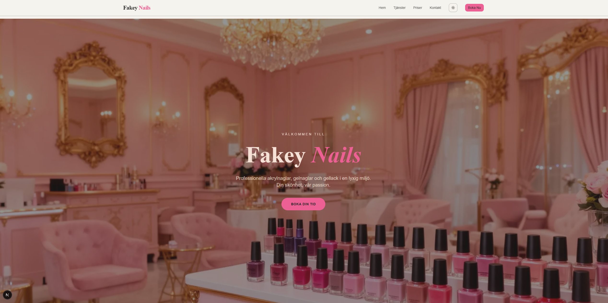
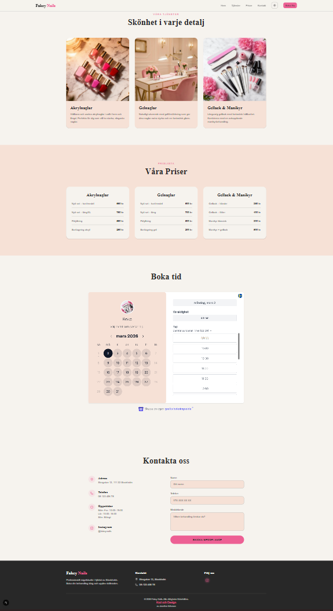
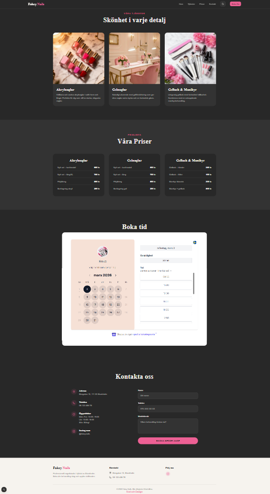

# Fakey Nails – Webbplats

En modern marknadsföringssajt för en fiktiv nagelsalong. Byggd med aktuella webbverktyg och kopplad till ett headless CMS så att ägaren kan uppdatera text, priser, tjänster och bilder utan att röra koden.

---

## Skärmdumpar

### Startsida


### Desktop – ljust läge


### Desktop – mörkt läge


### Mobil
<p align="center">
  
  
</p>

---

## Funktioner

- **Next.js 16 (App Router)** & **TypeScript**
- **Tailwind CSS v4** med anpassad OKLCH-palett och mörkt läge
- Responsiv layout: hero, tjänstekort, prislista, kontaktformulär och bokningssida
- Temväxlare (ljust / mörkt / system) i navigeringen
- **Sanity CMS** för redigerbart innehåll (gratisnivå)
- Statisk generering med inkrementell revalidering (60 s)
- Kontaktformulär med **react-hook-form** + **Nodemailer** via API-route

## Teknikstack

| Syfte           | Teknologi                       |
|-----------------|---------------------------------|
| Ramverk         | Next.js 16 (React 19)           |
| Styling         | Tailwind CSS v4 + shadcn/ui     |
| Ikoner          | lucide-react                    |
| Formulär        | react-hook-form                 |
| E-post          | Nodemailer (via `/api/contact`) |
| CMS             | Sanity (studio på `/studio`)    |
| Driftsättning   | Vercel (rekommenderat)          |

## Projektstruktur

```
app/
  components/     – Hero, Navbar, ServiceCards, PriceCards, Contact, Booking …
  api/contact/    – API-route för kontaktformuläret (Nodemailer)
  studio/         – Inbyggd Sanity Studio
public/           – Statiska tillgångar (bilder m.m.)
sanity/
  schemaTypes/    – Sanity dokumenttyper
  lib/            – Sanity-klient + bildhjälpare
  env.ts          – Miljövariabelhjälpare
```

## Kom igång lokalt

1. **Klona repot** och installera beroenden:
   ```bash
   git clone https://github.com/knixan/fakey-nails.git
   cd fakey-nails
   npm install
   ```

2. **Miljövariabler** – skapa en `.env.local` i rooten (se exempel nedan).

3. **Starta utvecklingsservern**:
   ```bash
   npm run dev
   ```

4. Öppna [http://localhost:3000](http://localhost:3000) för sajten och
   [http://localhost:3000/studio](http://localhost:3000/studio) för CMS-studion.

> Frontenden hämtar nytt innehåll från Sanity var 60:e sekund, så publicerade ändringar syns nästan direkt.

## Miljövariabler – `.env.local`

Skapa filen `.env` i projektets rot med följande variabler:

```dotenv
# Sanity
NEXT_PUBLIC_SANITY_PROJECT_ID=ditt-projekt-id
NEXT_PUBLIC_SANITY_DATASET=production

# SMTP-inställningar för kontaktformuläret exempel visas med https://ethereal.email/
SMTP_HOST=smtp.ethereal.email
SMTP_PORT=587
SMTP_SECURE=false
SMTP_USER=din@email.com
SMTP_PASS=ditt-app-lösenord

# E-postadress som tar emot formulärmeddelanden
CONTACT_EMAIL=din@gmail.com
```

> **Gmail-tips:** Använd ett *App Password* (inte ditt vanliga lösenord).
> Aktivera det under Google-kontot → Säkerhet → Tvåstegsverifiering → App-lösenord.

## Redigera innehåll

Använd Sanity Studio för att ändra:

- Hero-rubrik, underrubrik, beskrivning, CTA-knapp och bakgrundsbild
- Tjänstekort (titel, beskrivning och valfri bild)
- Kategorier och prisposter i prislistan

Nytt innehåll hämtas vid varje bygge och löpande under körning. Kör `npm run build` för att generera med helt färskt innehåll inför en driftsättning.

## Driftsättning

Repot är Vercel-klart – importera projektet så identifieras Next.js-ramverket automatiskt.

Lägg till samma miljövariabler i Vercel-dashboardens inställningar. Sanity Studio serveras automatiskt under `/studio` tack vare `basePath`-konfigurationen.
